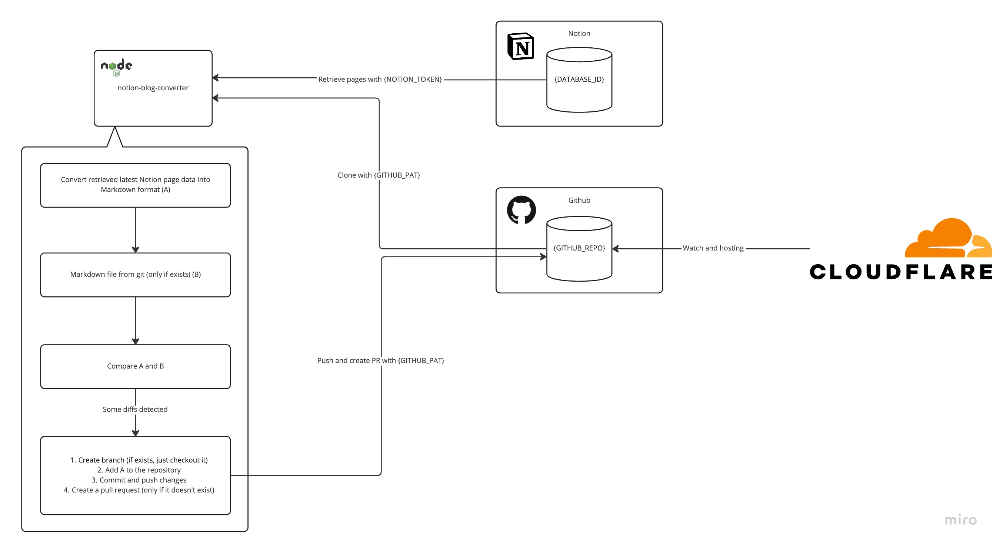
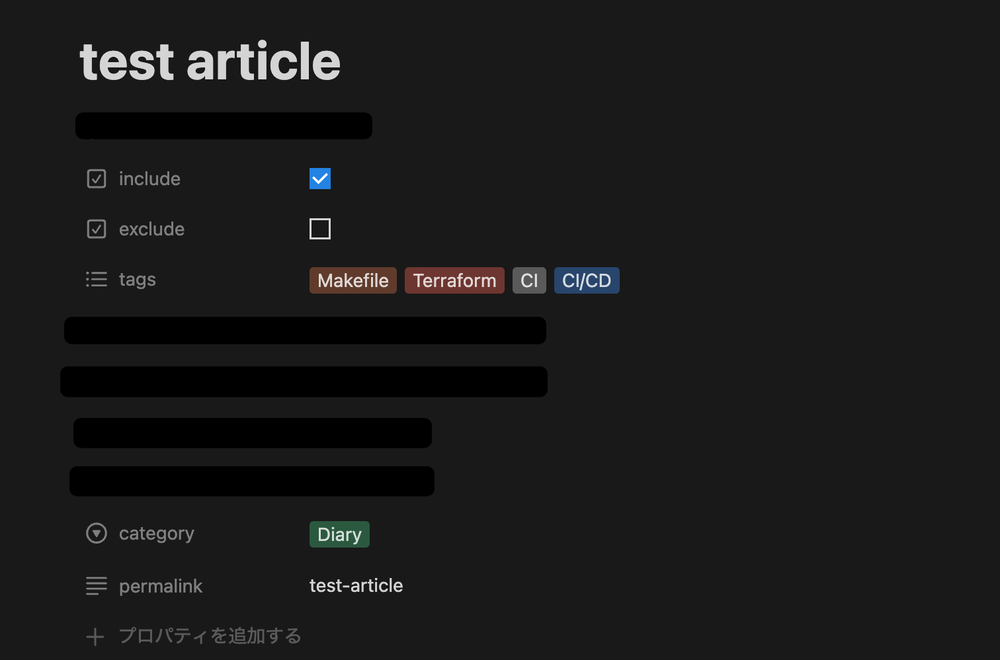
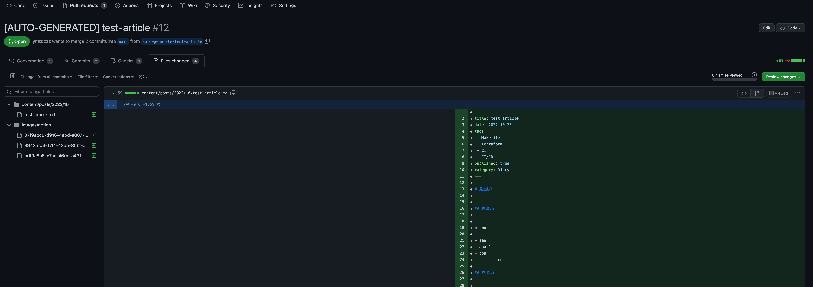

# notion-blog-converter

Convert notion data into Markdown and automatically push and create pull request.
This should work with markdown-based static site generators like Gridsome or hugo etc.
(I use this on gridsome and Cloudflare Pages)

## Architecture



## Prerequisites
- Your site can be generated by static site generators
- PR-based CICD pipeline such as [Cloudflare Pages](https://developers.cloudflare.com/pages/get-started/)

## Getting started
Setup your Notion database.




```sh
# install dependencies
yarn
# create dotenv file from example
cp .env.example .env
# modify .env according to your environment
vim .env
yarn app-run
```

If updated detected, PR will be created



## Environment variables

- `DATABASE_ID`: Your Notion database id
- `PROP_NAME_PERMALINK`: Property name of permalink in your database
- `PROP_NAME_TAG`: Property name of tag in your database
- `PROP_NAME_CATEGORY`: Property name of category in your database
- `PROP_NAME_INCLUDE`: Property name of include in your database. This tool convert the page with it turned ON
- `PROP_NAME_EXCLUDE`: Property name of exclude checkbox in your database. This tool DOES NOT convert the page with it turned ON
- `GITHUB_REPO`: Github repository url of your blog
- `GITHUB_PAT`: Github personal access token
- `NOTION_TOKEN`: Notion token
- `BLOG_ASSET_DIR`: Asset directory path from your blog repository's root path. It used as directory path of downloaded image path as below:

```sh
# Just after converting from Notion page data into markdown, the image path still points to Notion's S3 bucket.


# This tool downloads images and replaces image paths to local image path.

```

- `BLOG_POST_DIR`: Post directory path from your blog repository's root path like `content/posts`
